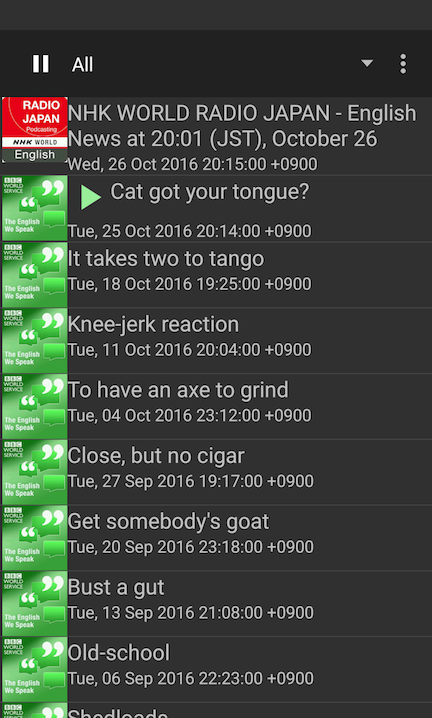
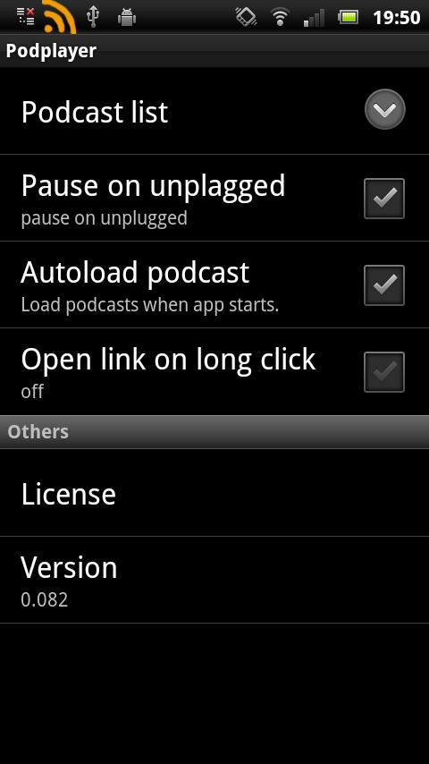

===============================================================================
podplayer - a simple android podcast player
===============================================================================

What?
----------
A simple podcast player android application.

How to build
------------
1. clone source
2. update project
    * In this directory
     android update project -p . -n podplayer -t android-10
    * In libsrc/pulltorefresh/pulltorefresh directory
     android update project -p . -n pulltoupdate -t android-10
### ant
    ant debug
A file bin/podplayer-debug.apk is created if succeed.
### Eclipse
TODO: write here

Screenshot
----------

TODO
----------
* fix a bug that sometimes update podcast is blocked
   * by setting read timeout appropriately to HttpConnection?
* add HTTP proxy setting
* sort episode by date
* ipdate podcast list by pull list to down
* add search UI
* acquire wifi lock?
http://developer.android.com/guide/topics/media/mediaplayer.html
* add error handling
    * clear notification on error
* add UI to add podcast URL
    * Web browser displays text/xml as content (I want intent...)
* add UI to abort loading
* display mark which is already played, new item etc...
* show web page of podcast
* display site icon of podcast
* add date and link to episode list
* add test

License
----------
* podplayer: Copyright (c) 2012 Takashi Masuyama. All rights reserved. 
Licensed under the [Apache License, Version 2.0](http://www.apache.org/licenses/LICENSE-2.0.html)

* podplayer uses the following software which is licensed under the 
[Apache License, Version 2.0](http://www.apache.org/licenses/LICENSE-2.0.html)
Copyright (c) 2011 [Johan Nilsson](http://markupartist.com)
https://github.com/johannilsson/android-pulltorefresh

----
Takashi Masuyama < mamewotoko@gmail.com >  
http://www002.upp.so-net.ne.jp/mamewo/
